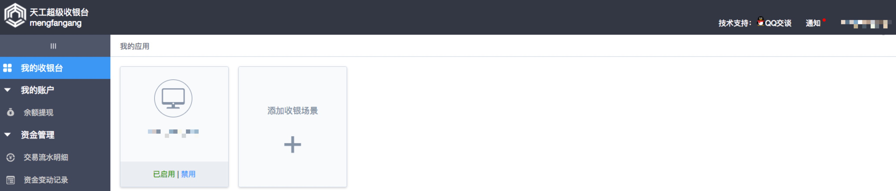
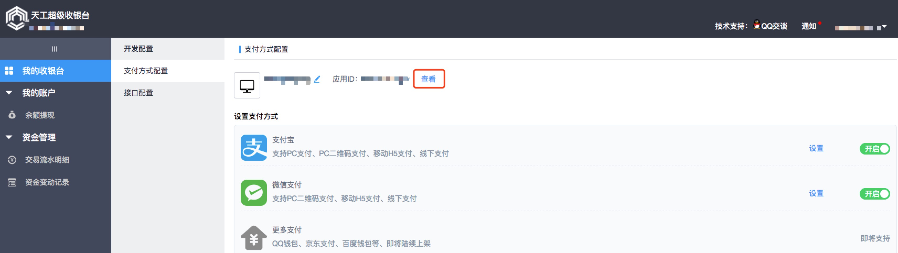
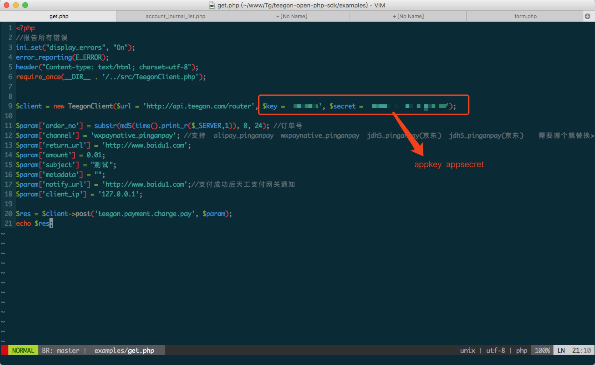
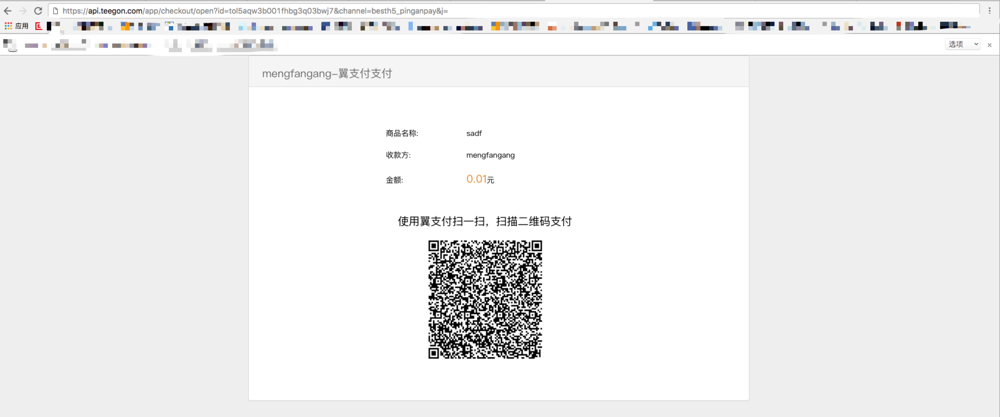
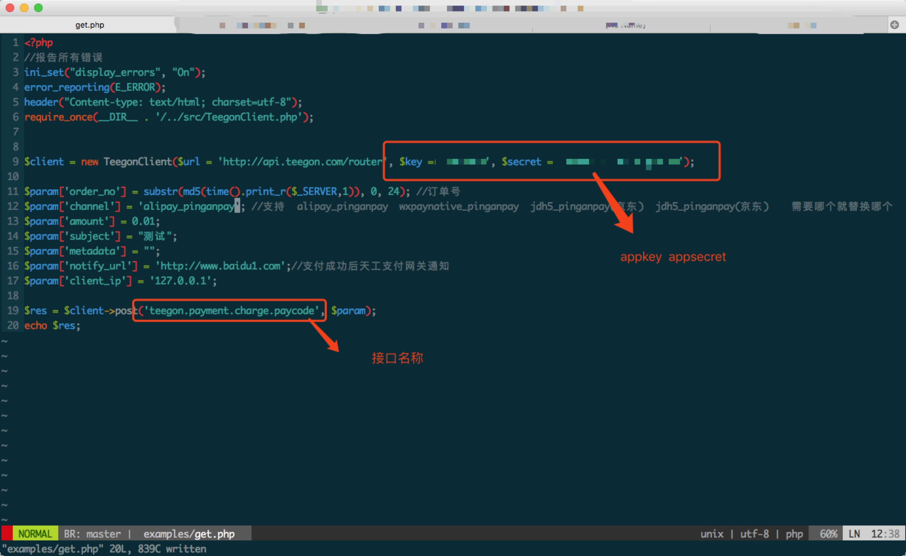
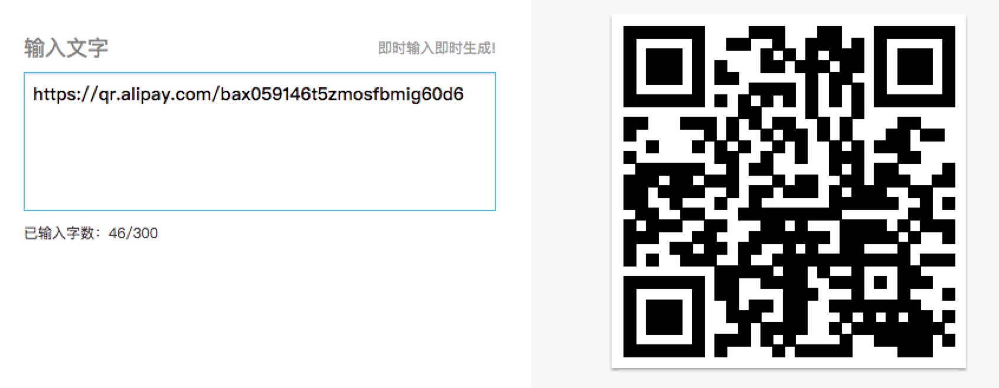

# 天工收银支付对接(开放平台)

该文档用于介绍如何对接天工收银。天工收银是商派2016年推出的一款新产品，集成了多种支付方式，如微信支付、支付宝等。一方面能以多场景的付款二维码，付款链接等帮助企业快速拓展收银场景。另一方面也能通过支付，分账等开放接口，来实现企业特殊的收银需求，例如全渠道统一收银，平台多角色分账等。
***
### Author: MengFanGang
### TeegonQQ: 2852516607
### TeegonMobile: 021-33251603
------

### 准备工作
1. 天工开放平台`appKey` `appScrect` 。[如何获取appKey，appScrect](#如何获取appKeyappScrect)
2. 天工开放平台sdk。 [如何使用天工开放平台sdk](#如何使用天工开放平台sdk)
---------

### 如何获取appKeyappScrect

当你拥有了一个天工账号之后请到 [scc.teegon.com](https://scc.teegon.com) 登陆。  
1. 在登陆后的首页中可以看到`我的应用`中有一个默认应用。点击这个应用  
  

2. 点击过后会进入到应用界面  
  

3. 点击查看便可以看到自己这个应用的`appKey`,`appScrect`


### 如何使用天工开放平台sdk

当你拥有了我们需要的`appKey`,`appScrect`我们便可以使用开放平台的sdk来对接支付。

1. 首先我们要拥有一个skd。下载地址:[php](https://github.com/shopex/teegon-open-php-sdk/) [Go]( https://github.com/shopex/teegon-open-go-sdk/) [NodeJs](https://github.com/shopex/teegon-open-nodejs-sdk/) (之后会对各种语言进行补充) 使用的介绍文档：[帮助文档](https://opennew.teegon.com/doc/?p=156)

2. 我们以php为例来介绍下这个sdk如何使用  
`examples/get.php`  
请求 支付接口：`teegon.payment.charge.pay`
```
请求参数：
order_no        订单号
channel         支付方式
return_url      同步跳转地址
amount          订单金额
subject         商品名称
metadata        备注字段
notify_url      异步回调地址
client_ip       ip地址
```


我们来看下会得到什么
```
{
    "ecode": 0,
    "emsg": "",
    "result": {
        "id": "8ajnail27reo7gcjps2to9qa", //天工支付单号 charge_id  务必保留在自己的系统中对应自己的订单
        "domain_id": "a8b14e7e",
        "orderno": "d3212313123",
        "channel": "besth5_pinganpay",
        "amount": 0.01,
        "real_amount": 0.01,
        "client_ip": "",
        "currency": "RMB",
        "subject": "sadf",
        "body": "",
        "time_expire": 1498727247,
        "return_url": "https://openne0w.teegon.com",
        "notify_url": "https://openne0w.teegon.com",
        "device_id": "",
        "charge_type": "",
        "account_id": "",
        "auth_code": "",
        "sale_channel": "",
        "buyer_account": "",
        "seller_account": "",
        "description": "besth5_pinganpay",
        "paid": false,
        "livemode": false,
        "refunded": false,
        "amountsettle": 0,
        "time_paid": 0,
        "time_settle": 0,
        "created": 1498726647,
        "updated": 0,
        "transaction_no": "",
        "amount_refunded": 0,
        "failure_code": "",
        "failure_msg": "",
        "metadata": "asdf",
        "wx_openid": "",
        "buyer_openid": "",
        "bank": "",
        "action": {
            "type": "url",
            "url": "https://api.teegon.com/app/checkout/open?id=8ajnail27reo7gcjps2to9qa&channel=besth5_pinganpay&j=",
            "params": null
        },
        "profit_error": "",
        "profit_apply_time": 0,
        "profit_result": "",
        "fee_type": 1,
        "pay_rate": 1,
        "subsidy_rate": 0,
        "fee": 0,
        "manual_journal": 0,
        "product_type": 1
    }
}
```

将这个account中的 url 拿出来 放在 浏览器的url上就可以得到支付页面了  

`别扫这个二维码这个二维码是假的` 
```
这种方式是直接给出天工收银规定好的页面，所以这种方式也是只支持pc端的。如果当对接方需要自定义这个支付页面
就要用到另一个接口仅获取二维码。
```

请求 支付接口：`teegon.payment.charge.paycode`
```
请求参数：
order_no        订单号
channel         支付方式
amount          订单金额
subject         商品名称
metadata        备注字段
notify_url      异步回调地址
client_ip       ip地址
```
  
```

{
  "ecode": 0,
  "emsg": "",
  "result": {
    "id": "8908n5lgupne3r3t8bkastdc",
    "domain_id": "a8b14e7e",
    "orderno": "43473bb5c0afa0cfcdabcab3",
    "channel": "alipay_pinganpay",
    "amount": 0.01,
    "real_amount": 0.01,
    "client_ip": "",
    "currency": "RMB",
    "subject": "测试",
    "body": "",
    "time_expire": 1498729861,
    "return_url": "",
    "notify_url": "http://www.baidu1.com",
    "device_id": "",
    "charge_type": "",
    "account_id": "",
    "auth_code": "",
    "sale_channel": "",
    "buyer_account": "",
    "seller_account": "",
    "description": "alipay_pinganpay",
    "paid": false,
    "livemode": false,
    "refunded": false,
    "amountsettle": 0,
    "time_paid": 0,
    "time_settle": 0,
    "created": 1498729261,
    "updated": 0,
    "transaction_no": "",
    "amount_refunded": 0,
    "failure_code": "",
    "failure_msg": "",
    "metadata": "",
    "wx_openid": "",
    "buyer_openid": "",
    "bank": "",
    "action": {
      "type": "url",
      "url": "https://qr.alipay.com/bax059146t5zmosfbmig60d6",
      "params": ""
    },
    "profit_error": "",
    "profit_apply_time": 0,
    "profit_result": "",
    "fee_type": 1,
    "pay_rate": 1,
    "subsidy_rate": 0,
    "fee": 0,
    "manual_journal": 0,
    "product_type": 1
  }
}
```

这个action中的url转换成二维码会可使用相应的客户端扫码进行支付。此时的同步跳转需要自行在对接方的自定义页面中自行实现。

  

`再说一遍不要扫这个二维码`

```
以上的两种方式都是PC端对接.如果对接方需要对接微信的jsapi支付就要用一下的方式同样是 
`teegon.payment.charge.paycode` 接口，不同的是支付方式改为  `wxpaymp_pinganpay`
```

```
{
  "ecode": 0,
  "emsg": "",
  "result": {
    "id": "1f83n2vyq9jgorsutlnt40y6",
    "domain_id": "a8b14e7e",
    "orderno": "52d379fb87cd9440056f86ec",
    "channel": "wxpaymp_pinganpay",
    "amount": 0.01,
    "real_amount": 0.01,
    "client_ip": "",
    "currency": "RMB",
    "subject": "测试",
    "body": "",
    "time_expire": 1498731152,
    "return_url": "http://www.baidu1.com",
    "notify_url": "http://www.baidu1.com",
    "device_id": "",
    "charge_type": "",
    "account_id": "",
    "auth_code": "",
    "sale_channel": "",
    "buyer_account": "",
    "seller_account": "",
    "description": "wxpaymp_pinganpay",
    "paid": false,
    "livemode": false,
    "refunded": false,
    "amountsettle": 0,
    "time_paid": 0,
    "time_settle": 0,
    "created": 1498730552,
    "updated": 0,
    "transaction_no": "",
    "amount_refunded": 0,
    "failure_code": "",
    "failure_msg": "",
    "metadata": "",
    "wx_openid": "",
    "buyer_openid": "",
    "bank": "",
    "action": {
      "type": "js",
      "url": "",
      "params": "window.location=\"https://api.teegon.com/app/checkout/wx?id=1f83n2vyq9jgorsutlnt40y6\u0026channel=wxpaymp_pinganpay\u0026t=1498730552\""
    },
    "profit_error": "",
    "profit_apply_time": 0,
    "profit_result": "",
    "fee_type": 1,
    "pay_rate": 1,
    "subsidy_rate": 0,
    "fee": 0,
    "manual_journal": 0,
    "product_type": 1
  }
}
```
在这个acton中的prarms 是一段js 只用在微信浏览其中 打开一个html 然后 执行这段js  即可调起微信钱包支付。

### 支付回调
签名方法如下
1、排序
对所有 API 请求参数(包括系统级参数和业务参数，但除去 sign 参数和 byte[]类型的参数)，
根据参数名称的 ASCII 码表的顺序排序。如:foo=1, bar=2, foo_bar=3, foobar=4 排序后的顺 序是 bar=2, foo=1, foo_bar=3, foobar=4。
2、拼接
将排序好的参数名和参数值以<key1><value1><key2><value2>...<keyn><valuen>方式首 尾相椄成连续字符串，根据上面的示例得到的结果为: bar2foo1foo_bar3foobar4。
3、签名
在排序字符串首尾分别拼接 appSsecret 后，进行 Md5 计算所得字符串进行大写处理得到最 终的 sign
