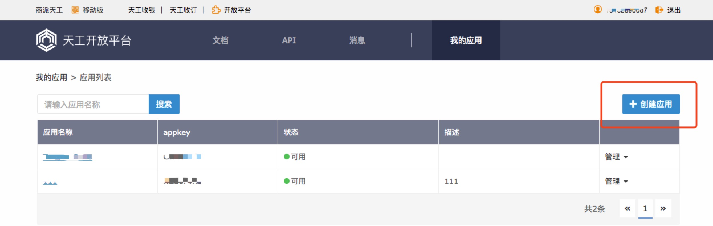
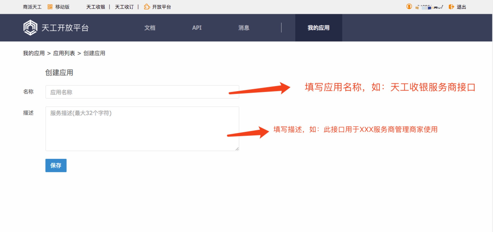
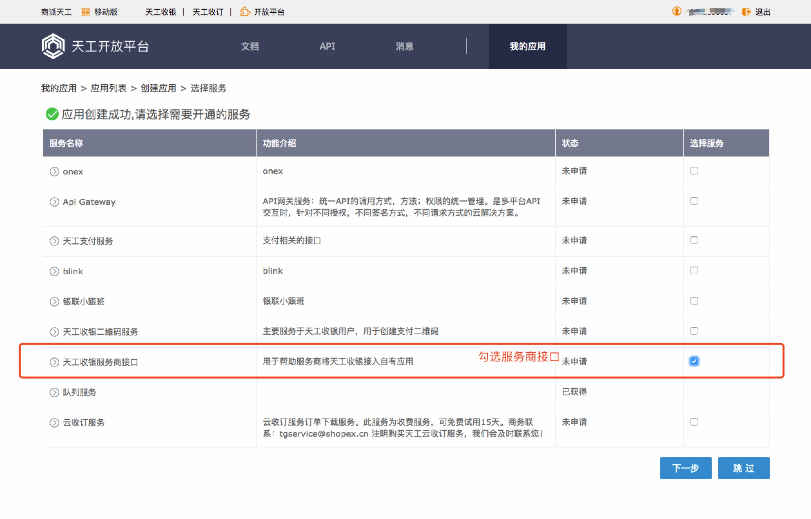
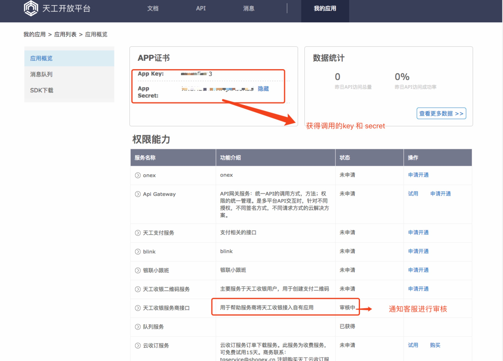
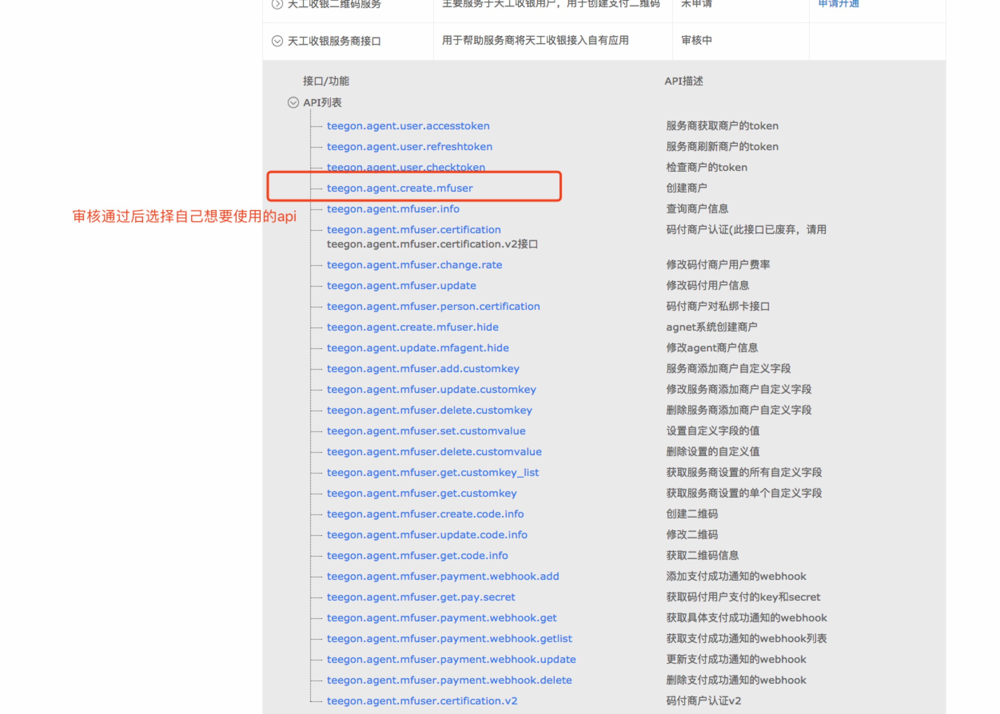
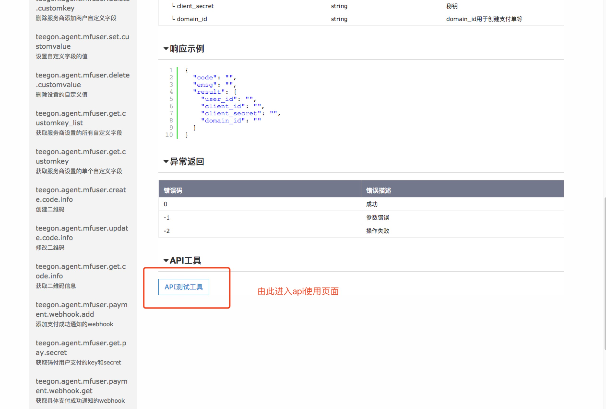
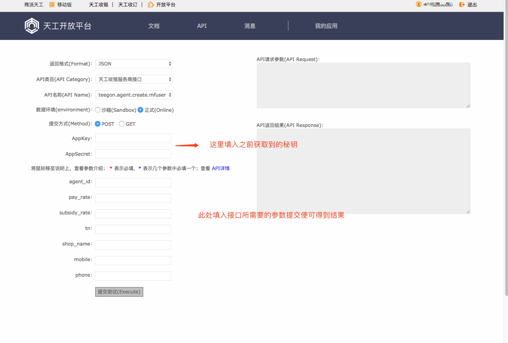

## 服务商自主对接文档（持续更新）

------------

### 目录
- [服务商接口权限申请](#服务商接口权限申请)
- [服务商接口说明](#服务商接口说明)
- [商家相关操作对接说明](#商家相关操作对接说明)
***********

#### 服务商接口权限申请
--------
申请地址：`https://opennew.teegon.com/`

申请流程：
1. 使用服务商账号密码在`https://opennew.teegon.com/`登陆
2. 在登录页面找到`创建应用`的按钮  
  
3. 进行创建应用  
   
4. 勾选所创建的应用所需要开通的接口  
   
5. 等待审核（自行联系客服要求开通）
   
6. 审核通过后进行使用
   
   
   

#### 服务商接口说明
--------
服务商后台地址：`http://agent.teegon.com/`
认证后的服务商可以在这里进行创建商家，修改商家数据，设置商家费率等操作，所有的操作都是可以通过api接口进行批量的操作
服务商api接口地址: `https://opennew.teegon.com/apis/db/6fHWwRp`
服务商的相关操作在此都可以找到相关接口

#### 商家相关操作对接说明
-----
想要了解商家有哪些相关操作需要先关注微信公众号`天工码付`登陆商家账号之后我们看到的便是商家可以进行的相关操作。
`注意`： 目前的商家端操作并不开放接口，如果有需要自主制作app的客户我们所提供的对接方式是通过服务商接口获取`access_token`并在公众号中任意页面的url后面跟上`access_token`便可以访问到这个商家的相应的页面,通过这种方式实现商家在服务商的app中进行绑卡，提现 等所有的操作
获取接口的地址为服务商api接口地址:`https://opennew.teegon.com/apis/db/6fHWwRp`
接口名称:`teegon.agent.user.accesstoken`
